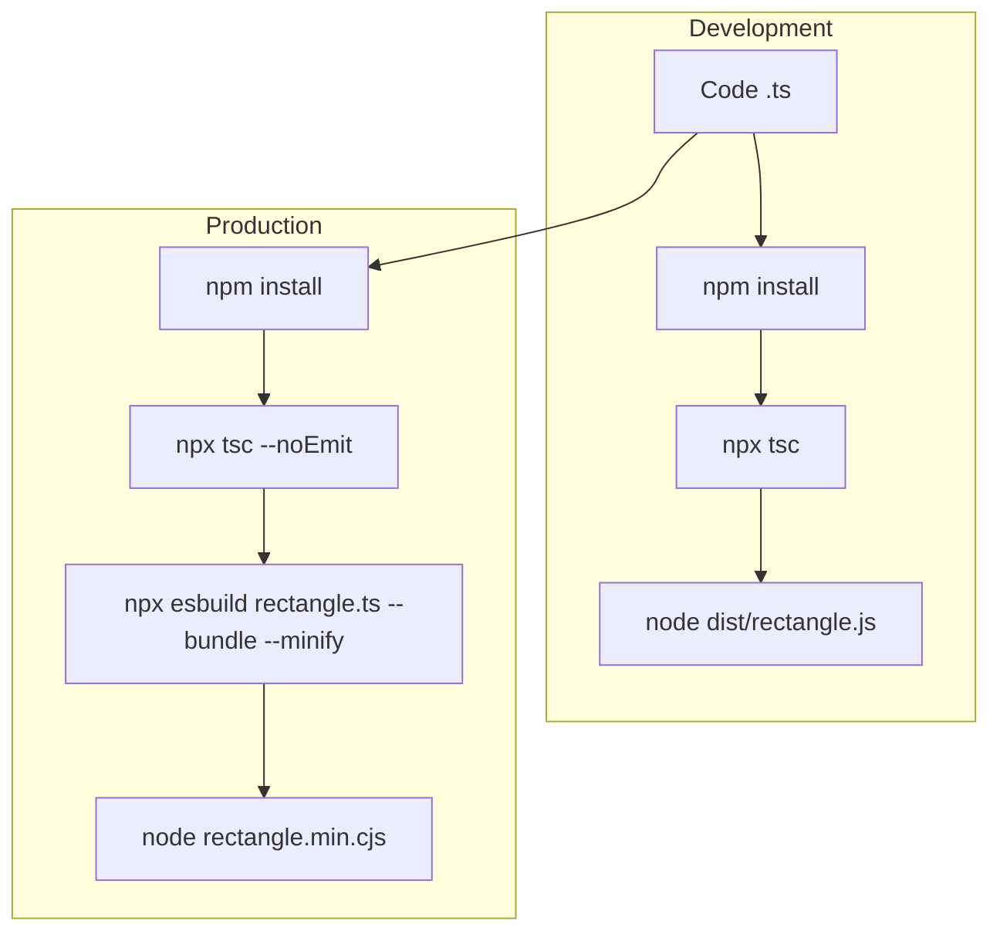
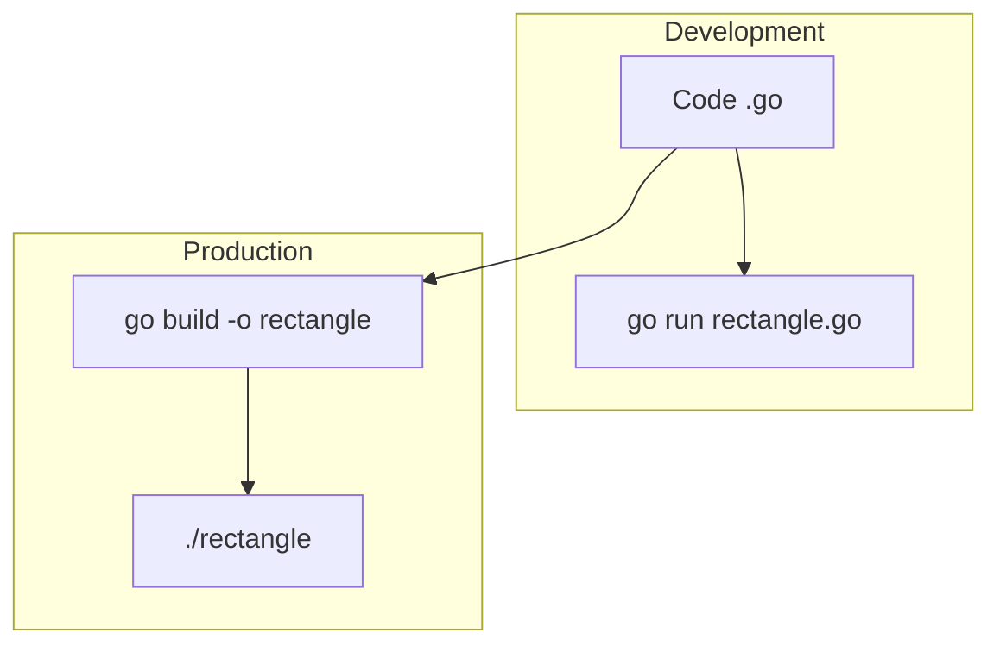

People keep saying Go is a compiled language, as if that settles the discussion. It does not.

For small tools, CLIs, CI helpers, YAML manglers, JSON transformers, and one-off internal utilities, the category that matters is not *interpreted* versus *compiled*. The category that matters is: **does the edit-run loop feel instant, and is shipping the result painless?**

By that standard, **Go is basically a scripting language**.

No, not academically. Obviously there is a compiler. Calm down.

I mean that in the only way that matters in practice: for a huge class of real software, `go run` is close enough to script-fast that the old mental split stops being useful. You type code, run code, get output, repeat. Then when the tool is worth keeping, `go build` gives you a single binary and you are done.

People like to say Python or Node.js are easier because they "just run source files." That was a better argument fifteen years ago. Modern workflows are not that simple anymore.

- **Python** means `pip`, virtual environments, and very often `uv` if you want the workflow to stop feeling ancient.
- **Node.js** means CJS versus ESM nonsense, package churn, and in any serious codebase, TypeScript on top of JavaScript on top of bundling.

If the point of a scripting language is that you get a fast feedback loop and low ceremony, then the loop matters more than the implementation category.

This is roughly what the modern typed Node.js workflow looks like:

And this is Go:

That is why I call Go a scripting language. Not because it lacks a compiler, but because the compiler is cheap enough that it stops being the point.

## What I actually mean

1. **`go run` is fast enough to live in the script niche.** If the tool starts quickly enough that I stay in the same edit-run mental loop, I do not care that a compiler briefly existed.
2. **`go build` is boring, and boring is good.** You get one binary. No runtime circus. No "works on my machine because my local environment is weird."
3. **`go mod` does not dominate your day.** The package story is integrated enough that dependency management usually feels like background noise rather than a lifestyle.
4. **The standard library is unusually useful.** You can get surprisingly far with the built-ins before you need to go shopping for packages.

Go is not my favorite compiled language. Compared to C++ or Rust, it is slower, fatter, and far less ambitious. That is not the point. The point is that for small serious tools, Go steals the ergonomic excuse that people use to justify Python and Node.js.

## The benchmark that actually matters

The important benchmark here is not some heroic CPU torture test. It is **time to useful output** for real tooling.

The following numbers compare a tiny CLI application using normal argument parsing and YAML parsing libraries. In other words: the kind of thing people love to call a "script."

#### CLI (Compiled Binary)

| Benchmark | Command | Mean Time (+/- sigma) |
| :--- | :--- | :--- |
| **Go** | `./rectangle test.yaml` | 1.1 ms +/- 0.1 ms |
| **Node.js (minified)** | `node rectangle.min.js test.yaml` | 19.6 ms +/- 1.1 ms |
| **Python** | `python3 rectangle.py test.yaml` | 19.9 ms +/- 1.5 ms |
| **Node.js** | `node rectangle.js test.yaml` | 23.2 ms +/- 2.1 ms |

**Summary:** Go ran about **17-20x** faster than the interpreted alternatives. That is the whole point. For a tiny tool, interpreter startup and runtime baggage *are* the workload.

#### CLI Cold Build (Including Compilation)

| Benchmark | Command | Mean Time (+/- sigma) |
| :--- | :--- | :--- |
| **Python** | `python3 rectangle.py test.yaml` | 19.6 ms +/- 1.2 ms |
| **Node.js** | `node rectangle.js test.yaml` | 24.1 ms +/- 2.7 ms |
| **Go** | `go build && ./rectangle test.yaml` | 107.1 ms +/- 4.9 ms |
| **Node.js (bundled)** | `npx esbuild ... && node rectangle.min.js test.yaml` | 128.3 ms +/- 2.7 ms |

This is the strongest objection to my argument, so let us state it plainly: yes, on a trivial cold run, Python wins. Fine. But **107 ms is still "rerun it without thinking" territory**. That is exactly why Go invades scripting-language territory in practice.

If your compiled language is fast enough that the compile step barely registers in the human loop, then the textbook distinction starts to matter a lot less.

#### CLI Cold Build with TypeScript (The Real Node.js Workflow)

People love comparing Go against plain JavaScript, then quietly writing TypeScript in the real world. Let us compare against the workflow people actually use.

| Benchmark | Command | Mean Time (+/- sigma) |
| :--- | :--- | :--- |
| **Python** | `python3 rectangle.py test.yaml` | 20.1 ms +/- 1.1 ms |
| **Go** | `go build && ./rectangle test.yaml` | 107.5 ms +/- 7.9 ms |
| **TypeScript** | `npx tsc && node dist/rectangle.js test.yaml` | 414.8 ms +/- 7.8 ms |
| **TypeScript (bundled)** | `npx tsc --noEmit && npx esbuild ... && node rectangle.min.cjs test.yaml` | 505.5 ms +/- 6.0 ms |

Now the old "compiled versus scripting" story really falls apart. If your so-called scripting workflow already involves compilation, then Go's compiler is not the embarrassing part of the pipeline. It is the efficient part.

That is the paradox. People tolerate TypeScript's compile step because they want types, but Go gives you types *and* a much cheaper loop. So why is TypeScript still the "easy" option while Go is filed under "compiled language, therefore different bucket"? Pure inertia.

## And yes, Go also runs the work faster

If you still want the dumb CPU benchmark, here it is: bubble sort on a fixed randomly generated array of `float32`.

#### CPU-Heavy Workload (Bubble Sort - Compiled Binary)

| Benchmark | Command | Mean Time (+/- sigma) |
| :--- | :--- | :--- |
| **Go** | `./bubblesort` | 30.6 ms +/- 1.6 ms |
| **Node.js** | `node bubblesort.js` | 64.6 ms +/- 2.5 ms |
| **Node.js (minified)** | `node bubblesort.min.js` | 64.1 ms +/- 3.1 ms |
| **Python** | `python3 bubblesort.py` | 1.897 s +/- 0.014 s |

**Summary:** Go ran **2.1x** faster than Node.js and **62x** faster than Python.

#### Cold Build (Bubble Sort - Including Compilation)

| Benchmark | Command | Mean Time (+/- sigma) |
| :--- | :--- | :--- |
| **Go** | `go build && ./bubblesort` | 77.5 ms +/- 3.6 ms |
| **Node.js** | `node bubblesort.js` | 63.3 ms +/- 1.8 ms |
| **Node.js (bundled)** | `npx esbuild ... && node bubblesort.min.js` | 169.3 ms +/- 2.9 ms |
| **Python** | `python3 bubblesort.py` | 1.933 s +/- 0.035 s |

Plain JavaScript wins that tiny cold-start round by a little. Good for JavaScript. The broader point still stands: Go's compile step is small enough to stay in the same workflow class, while giving you a far better end state once the tool stops being toy-sized.

No, this does not replace shell for five-line one-offs. No, it does not replace JavaScript in front-end code. No, it does not replace Python in notebook-heavy scientific work.

That is not the claim.

The claim is much simpler, and much more annoying: if a language gives you `go run`, a cheap compile step, a good enough package story, and a static binary at the end, then for a huge amount of tooling work it is basically acting as a scripting language already.

Call it compiled if it makes you happy. I will still use it like a script.
