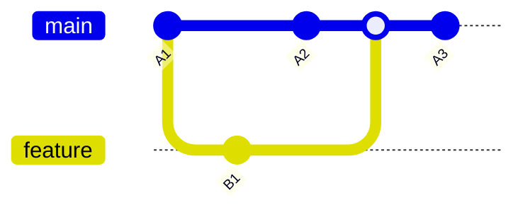

"Let me just rebase this real quick"

Git rebase is often sold as a way to maintain a "clean" history. The claim is that a linear sequence of commits is easier to read and understand. This is false.

When you rebase, you rewrite commit hashes. The original commits, their timestamps, context, and the order in which changes actually happened, are destroyed. History should be immutable. Rebase violates this principle, and every downstream tool that depends on accurate history suffers for it.

When you rebase a branch that others have based work on, you force them to deal with divergent histories. This means force pushes that overwrite teammates' work, lost commits when people pull the rebased branch, and hours wasted resolving conflicts that should not exist.

With merge, you resolve conflicts once. With rebase, you resolve the same conflict multiple times, once for each commit being replayed.

Rebase destroys tooling. `git bisect` points to commits that never existed in actual development. `git blame` shows rewritten commits, losing true authorship context. After a code review, reviewers cannot see what changed since their last review because the commits they reviewed no longer exist. Force-pushed branches break GitHub and GitLab review tools.

Merge commits are informative. They show when features were integrated and by whom. Squash merge achieves linearity without rewriting history. A history that lies about what happened is worse than an honest one.

In this visual, it is simple. branch main is ahead of feature by 1 commit, and branch feature is ahead of main by one commit.
In a scenario with no conflict, if you want to rebase your feature branch commits on top of main, you will NEED to force push. Thats already super dumb workflow.
Then, if we imagine n commits with n conflicts, which should not happen in a good communicative team, but it will happen if your collaborators do not know you (e.g. open source).
You will then need to resolve conflicts for EVERY COMMITS. Thats a shit ton of work for a shit ton of nothing. Zero productivity boost and zero gains from it.

The worst has yet to come, as you will likely squash your PR to main at some point, if you want the main history to show a list of features (rather than a list of useless commits).
That means all that extra work is actually thrown in the bin. Thats right. You resolved n conflicts but there will be only one commit anyway at the end.
And I know what a few people will think. What if we rebase then the PR branch directly to main (thus keeping all the commits). Fantastic idea!
Actually thats really really not a good idea. You will merge n commits from your branch, but you will merge your branch only assuming the LATEST commit compiles and passes tests. Actually, all the conflicts you resolved before do not make any sense anyway.
You worked on a version A1 of main, added features, and somehow while resolving conflicts you are telling me that adding commits A2 and A3 from main in between your code will work? Did you actually check ?
Thats the point, you didnt check, you wont check, and CI/CD will not check every individual commits. You kept a linear history of garbage commits.

Rebasing latest main onto your feature branch is stupid because if you later squash, then it is wasted time and work, thrown away.
Rebasing your feature branch onto main (final merge) makes no fucking sense since none of the commits but the last one will be guaranteed to work. You just keep a linear history of trash.

Use merge when you want to preserve full feature branch history. Use squash merge when you want a linear main branch. Never use rebase for branches that have been pushed or shared.
