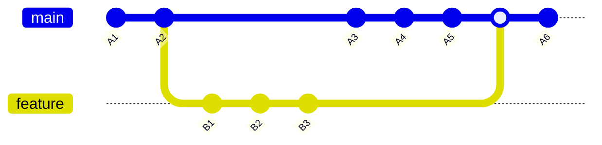

> "Let me just rebase this real quick"

Git rebase is often sold as a way to maintain a "clean" history. The claim is that a linear sequence of commits is easier to read and understand. This is false.

When you rebase, you rewrite commit hashes. The original commits, their timestamps, context, and the order in which changes actually happened, are destroyed. History should be immutable. Rebase violates this principle, and every downstream tool that depends on accurate history suffers for it.

When you rebase a branch that others have based work on, you force them to deal with divergent histories. This means force pushes that overwrite teammates' work, lost commits when people pull the rebased branch, and hours wasted resolving conflicts that should not exist.

With merge, you resolve conflicts once. With rebase, you resolve the same conflict multiple times, once for each commit being replayed.

Merge commits are informative. They show when features were integrated and by whom. Squash merge achieves linearity without rewriting history. A history that lies about what happened is worse than an honest one.

In this visual, it is simple. Branch main is ahead of feature by 3 commits, and branch feature is ahead of main by 3 commits.
In a scenario with no conflict, if you want to rebase your feature branch commits on top of main, you will **need** to force push. That's already a red flag.
Now imagine n commits with n conflicts. This should not happen in a communicative team, but it will happen when collaborators do not know each other, such as in open source.
You will then need to resolve conflicts for **every commit**. That's a ton of work for a ton of nothing. Zero productivity boost and zero gains from it.

The worst has yet to come, as you will likely squash your PR to main at some point, if you want the main history to show a list of features (rather than a list of useless commits).
This means that a PR squash would equal an issue, itself being a new feature or a bug fix or whatever.
That means all that extra work is actually thrown in the bin. That's right. You resolved n conflicts but there will be only one commit anyway in main.
And I know what a few people will think. What if we rebase then, the PR branch directly to main (thus keeping all the rewritten commits with a linear history). Fantastic idea!
Actually that's really a **bad** idea. You will rebase n commits from your branch, but you will merge your branch only assuming the **latest commit** compiles and passes tests. The conflicts you resolved represent states of the project that never existed and were never tested.
You worked on a version A2 of main, added features, and somehow while resolving conflicts you are telling me that adding commits A3, A4 and A5 from main in between your code will work? Did you actually check?
I know, you didn't check, you won't check, and CI/CD will not check every individual commit. You kept a linear history of **garbage commits**.

- Rebasing the latest main into your feature branch is wasted effort if you later squash the PR — all that extra conflict resolution is thrown away. You took unnecessary risk for the same **exact** result.
- Rebasing your feature branch on top of main rather than squashing adds untested commits on the main branch.
