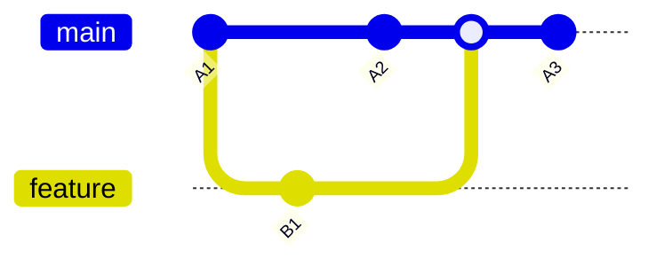

"Let me just rebase this real quick"

Git rebase is often sold as a way to maintain a "clean" history. The claim is that a linear sequence of commits is easier to read and understand. This is false.

When you rebase, you rewrite commit hashes. The original commits, their timestamps, context, and the order in which changes actually happened, are destroyed. History should be immutable. Rebase violates this principle, and every downstream tool that depends on accurate history suffers for it.

When you rebase a branch that others have based work on, you force them to deal with divergent histories. This means force pushes that overwrite teammates' work, lost commits when people pull the rebased branch, and hours wasted resolving conflicts that should not exist.

With merge, you resolve conflicts once. With rebase, you resolve the same conflict multiple times, once for each commit being replayed.

Consider this scenario: main is ahead of feature by one commit, feature is ahead of main by one commit. No conflicts. If you want to rebase your feature branch on top of main, you need to force push. This is already overhead for zero benefit.

Now consider n commits with n conflicts. You resolve conflicts for every single commit. If you later squash merge to main, because you want your main history to show features rather than individual commits, all that conflict resolution work is discarded. You resolved n conflicts but there is only one commit at the end.

Some argue: rebase the feature branch directly to main and keep all the commits. This does not work either. CI/CD only validates the latest commit. All intermediate commits are unverified. You worked on version A1 of main, added features, then while resolving conflicts you inserted commits A2 and A3 from main in between your code. These intermediate states were never tested.

This is your "clean" history. A sequence of commits where only the last one is guaranteed to work. The rest are untested, unreviewed, and ahistorical.

Merge commits are informative. They show when features were integrated and by whom. Squash merge achieves linearity without rewriting history. A history that lies about what happened is worse than an honest one. If you want to go back to any commit in a linear history, CI/CD must test every single commit. Otherwise the linearity is meaningless.

Rebase destroys tooling. `git bisect` points to commits that never existed in actual development. `git blame` shows rewritten commits, losing true authorship context. After a code review, reviewers cannot see what changed since their last review because the commits they reviewed no longer exist. Force-pushed branches break GitHub and GitLab review tools.

GitHub defaults to merge commits. GitLab provides merge options prominently. Most CI/CD systems expect merge-based workflows. Squash merge exists specifically to provide a linear main branch without rewriting history.

Use merge when you want to preserve full feature branch history. Use squash merge when you want a linear main branch. Never use rebase for branches that have been pushed or shared.
