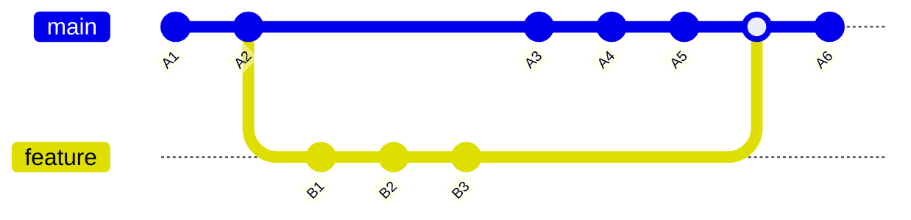
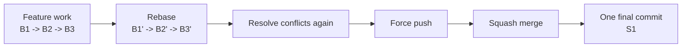
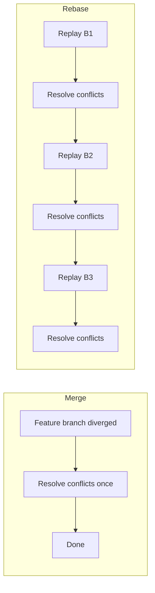

> Let me just rebase this real quick

Git rebase is sold as "clean history." That is nonsense. In practice, rebase usually does one of two things: either it adds pointless work before a squash merge, or it leaves you with a pretty linear history full of synthetic commits.

Here is the difference between honest history and rebased fiction:

**What actually happened**

```mermaid
gitGraph
   commit id: "A1"
   commit id: "A2"
   branch feature
   checkout feature
   commit id: "B1"
   commit id: "B2"
   commit id: "B3"
   checkout main
   commit id: "A3"
   commit id: "A4"
   commit id: "A5"
   merge feature
   commit id: "A6"
```

**What the rebased graph pretends happened**

```mermaid
gitGraph
   commit id: "A1"
   commit id: "A2"
   commit id: "A3"
   commit id: "A4"
   commit id: "A5"
   commit id: "B1'"
   commit id: "B2'"
   commit id: "B3'"
   commit id: "A6"
```

The primes matter. `B1'`, `B2'`, and `B3'` are not the original commits. They are rewritten replacements.

## If you squash later, rebasing was pointless

This is the dumbest common workflow in Git.

You rebase your branch onto main. You replay commits. You resolve conflicts. You force push. Then the pull request gets squash-merged anyway, and all of that effort is thrown in the bin.

Same final result. More risk. More labor. Zero gain.

If the branch is going to become one squashed commit in main, then rebasing it first was pure waste.

```mermaid
flowchart LR
    A["Feature work<br/>B1 -> B2 -> B3"] --> B["Rebase<br/>B1' -> B2' -> B3'"]
    B --> C["Resolve conflicts again"]
    C --> D["Force push"]
    D --> E["Squash merge"]
    E --> F["One final commit<br/>S1"]
```

## If you do not squash, you kept linear garbage

Some people think the answer is to keep the rebased commits on main for a "beautiful" linear history.

That is worse.

Those rebased commits are synthetic states of the project. They did not happen that way originally. They were rewritten after the fact, with conflicts manually resolved in between. CI does not validate each intermediate rebased commit as if it were a real historical state. Usually only the final branch tip gets tested.

So congratulations: you preserved a linear history of commits that never truly existed in that form and were never meaningfully validated one by one.

That is not clean history. That is fabricated history.

## Rebase rewrites history

Commit hashes change. Commit identity changes. The branch you had is gone and replaced with another one that only resembles it.

Then comes the force push, which is already a red flag. Once you normalize force pushes, you normalize replacing shared history after the fact. Everyone downstream pays for that: collaborators, tooling, blame, bisect, and anyone trying to understand what actually happened.

Merge commits may not satisfy people addicted to straight lines, but at least they tell the truth.

## Rebase multiplies conflicts

Merge resolves conflicts once.

Rebase resolves conflicts once per replayed commit.

That is the whole scam.

If your branch has three commits and all three collide with incoming changes, you get to do the same kind of cleanup repeatedly just to manufacture a prettier graph. And if the PR is squashed later, every minute of that work was pointless.

Rebase does not remove complexity. It spreads the same complexity across multiple artificial steps and calls that "clean."

```mermaid
flowchart LR
    subgraph Merge
        M1["Feature branch diverged"] --> M2["Resolve conflicts once"] --> M3["Done"]
    end

    subgraph Rebase
        R1["Replay B1"] --> R2["Resolve conflicts"]
        R2 --> R3["Replay B2"]
        R3 --> R4["Resolve conflicts"]
        R4 --> R5["Replay B3"]
        R5 --> R6["Resolve conflicts"]
    end
```

## Conclusion

Rebase is not discipline. It is busywork wrapped in aesthetics.

If you squash later, rebasing was wasted effort. If you keep the rebased commits, you preserved linear garbage. In both cases, the team paid extra for a prettier lie.

Merge once. Resolve once. Keep an honest history.
